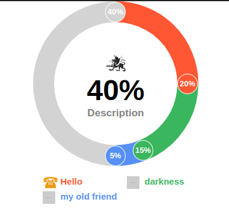

# donut-charts-with-handles
This repository is a npm module to generate donut graphs with handles based on each item percentage. You will be able to see graphs like the image below.

## Usage

Module usage is pretty simple. You just need to install the module and it has just one function <code>getDonut</code> that you need to call.
